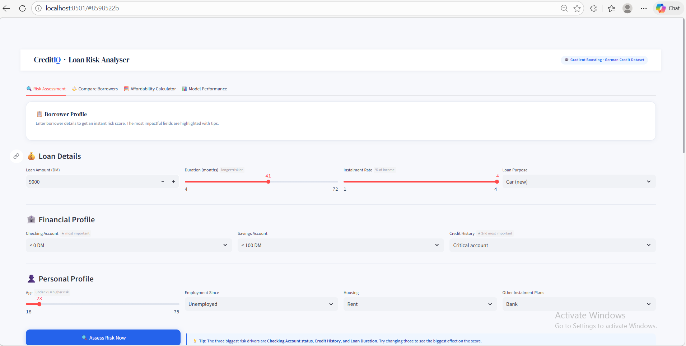
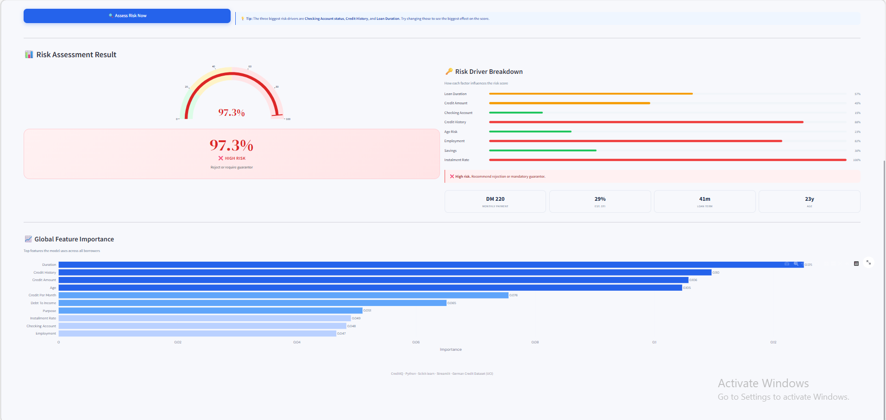
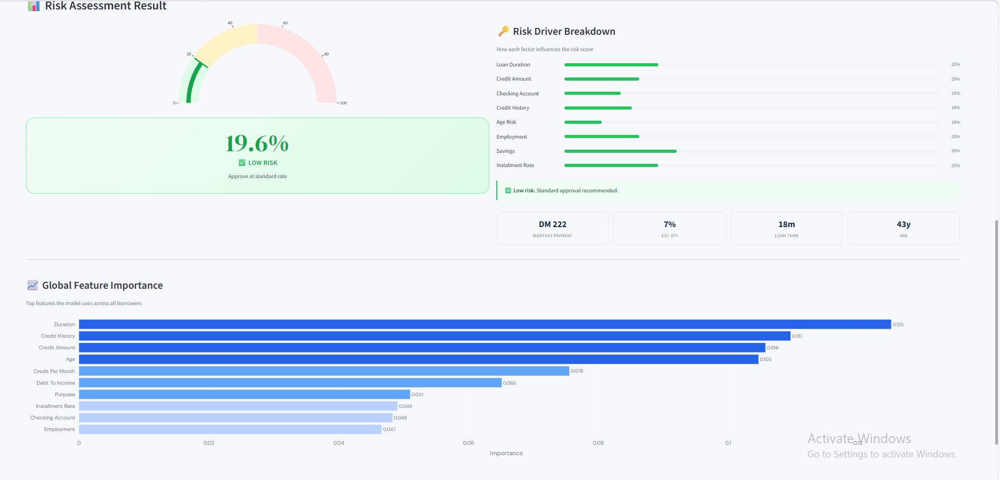
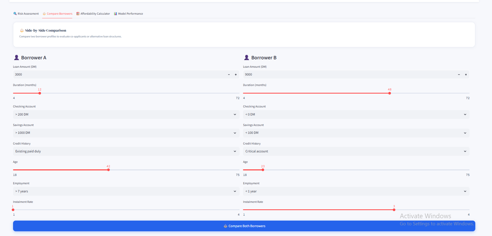
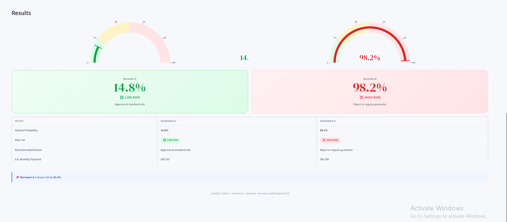
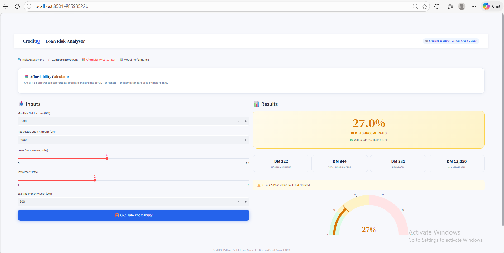
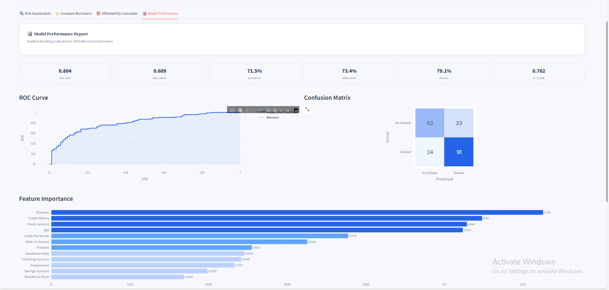
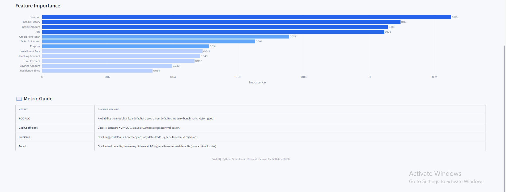

# 🏦 Credit Risk Prediction

A production-quality machine learning system that predicts loan default probability — built for banking and finance data science roles.


🚀 **Live Demo:** [Click to open dashboard]([https://vrushh7-credit-risk-analyser.streamlit.app](https://credit-risk-analyser-ml.streamlit.app/))

---

## 🖥️ Dashboard Preview

### Risk Assessment



### High Risk Borrower



### Low Risk Borrower



### Side-by-Side Borrower Comparison



### Comparison Results



### Loan Affordability Calculator



### Model Performance Report



### Feature Importance



---

## 🌟 Features

- **🔍 Risk Assessment** — Input borrower details and get an instant default probability score with a gauge, risk tier, and factor-by-factor breakdown
- **⚖️ Borrower Comparison** — Compare two applicants side by side with probability gauges and a full comparison table
- **🧮 Affordability Calculator** — Calculate DTI ratio, monthly payment, headroom, and maximum affordable loan amount
- **📊 Model Performance** — Full evaluation report with ROC curve, confusion matrix, Gini coefficient, and metric explanations
- **📈 12 EDA Charts** — Auto-generated exploratory data analysis plots saved to the reports folder
- **🏦 Business Insights** — Risk segmentation, policy recommendations, and interview talking points

---

## 🏗️ Architecture

The system consists of a modular Python ML pipeline and an interactive Streamlit dashboard.

### ML Pipeline (Python + Scikit-learn)
- **Data Layer** — German Credit Dataset (UCI) with synthetic data fallback
- **Preprocessing** — Missing value handling, label encoding, feature engineering
- **Models** — Logistic Regression, Random Forest, Gradient Boosting
- **Evaluation** — ROC-AUC, Gini, Precision, Recall, F1, Confusion Matrix

### Dashboard (Streamlit + Plotly)
- **Framework** — Streamlit 1.31
- **Charts** — Plotly for interactive gauges, ROC curves, bar charts
- **Styling** — Custom CSS with DM Sans font and professional light theme

---

## 📦 Dependencies

### Python Dependencies
```txt
pandas==2.1.4
numpy==1.26.4
scikit-learn==1.4.0
matplotlib==3.8.2
seaborn==0.13.2
streamlit==1.31.0
joblib==1.3.2
jupyter==1.0.0
notebook==7.0.7
ipykernel==6.29.0
plotly==5.18.0
imbalanced-learn==0.12.0
```

### System Requirements

- **Python** — 3.10 or higher
- **pip** — latest version recommended
- **RAM** — 4GB minimum

---

## 📁 Project Structure
credit-risk-analyser/
├── main.py                          # Pipeline entry point
├── requirements.txt                 # Python dependencies
├── README.md
├── src/
│   ├── data_loader.py               # Dataset loading & inspection
│   ├── preprocessing.py             # Cleaning, encoding, feature engineering
│   ├── eda.py                       # Visualisation suite (7 charts)
│   ├── model_trainer.py             # Training + evaluation (3 models)
│   └── business_insights.py        # Risk segmentation & policy recommendations
├── dashboard/
│   └── app.py                       # Streamlit interactive dashboard
├── notebooks/
│   └── credit_risk_analysis.ipynb  # Full interactive walkthrough
├── screenshots/                     # Dashboard preview images
└── reports/                         # Auto-generated EDA and evaluation plots

---

## 🗃️ Dataset

**German Credit Dataset** — UCI Machine Learning Repository
1,000 loan applicants with 20 features and a binary default target.

| Source | Link |
|--------|------|
| UCI Repository | https://archive.ics.uci.edu/dataset/144/statlog+german+credit+data |
| Kaggle mirror | https://www.kaggle.com/datasets/uciml/german-credit |

> If no dataset file is provided, the pipeline automatically generates realistic synthetic data with the same schema and runs end to end with no setup required.

---

## 🚀 Getting Started

### Prerequisites

1. **Install Python** (3.10 or higher)
   - Download from [python.org](https://python.org/)

2. **Install Git** (optional, for cloning)
   - Download from [git-scm.com](https://git-scm.com/)

### Installation

#### Option 1: Clone the repository
```bash
git clone https://github.com/YOUR_USERNAME/credit-risk-analyser.git
cd credit-risk-analyser
```

#### Option 2: Download ZIP
- Click the green **Code** button on this page → **Download ZIP** → Extract

### Setup

1. **Create a virtual environment**
```bash
python -m venv venv

# Activate it
venv\Scripts\activate          # Windows
source venv/bin/activate       # Mac / Linux
```

2. **Install dependencies**
```bash
pip install -r requirements.txt
```

3. **Run the full ML pipeline**
```bash
# With synthetic data (no download needed)
python main.py

# With real German Credit dataset
python main.py --data data/german.data

# Include interview prep notes
python main.py --interview

# Skip EDA for faster run
python main.py --skip-eda
```

4. **Launch the Streamlit dashboard**
```bash
streamlit run dashboard/app.py
```

5. **Open the Jupyter notebook**
```bash
jupyter notebook notebooks/credit_risk_analysis.ipynb
```

---

## 🤖 Models

| Model | Accuracy | ROC-AUC | F1-Score |
|-------|----------|---------|---------|
| Logistic Regression | 67.0% | 0.718 | 0.700 |
| Random Forest | 69.5% | 0.782 | 0.734 |
| **Gradient Boosting** ✓ | **71.5%** | **0.804** | **0.762** |

| Model | Why it's used in banking |
|-------|--------------------------|
| Logistic Regression | Interpretable coefficients; regulatory compliance; calibrated probabilities |
| Random Forest | Handles non-linear interactions; robust to outliers; stable feature importance |
| Gradient Boosting | Highest accuracy; industry standard for credit scoring (GBDT family) |

---

## 📊 Evaluation Metrics

| Metric | Value | Banking Meaning |
|--------|-------|----------------|
| ROC-AUC | 0.804 | Model ranks defaulters above non-defaulters 80% of the time |
| Gini Coefficient | 0.608 | Passes Basel III regulatory validation threshold (>0.50) |
| Precision | 73.4% | Of all flagged defaults, how many actually defaulted? |
| Recall | 79.1% | Of all real defaults, how many did we catch? |
| F1-Score | 0.762 | Harmonic balance of precision and recall |

---

## 📈 Generated Reports

All 12 charts are saved automatically to `reports/` when you run `python main.py`

| # | Chart |
|---|-------|
| 01 | Default distribution (bar + pie) |
| 02 | Credit amount vs default (KDE + boxplot) |
| 03 | Default rate by credit history |
| 04 | Age distribution by default status |
| 05 | Default rate by loan duration |
| 06 | Feature correlation heatmap |
| 07 | Default rate by savings account tier |
| 08 | ROC curves (all models) |
| 09 | Confusion matrices (all models) |
| 10 | Feature importance (all models) |
| 11 | Metric comparison dashboard |
| 12 | Decision threshold analysis |

---

## 🎯 Key Findings

- **Loan Duration** is the strongest default predictor — loans over 48 months default at 40%+ vs under 15% for short-term loans
- **Credit History** is the second biggest factor — critical account history leads to an 85% default rate
- **Checking Account** balance directly signals liquidity — overdrawn borrowers default at 2× the average rate
- **Young borrowers** under 25 default significantly more than those aged 35–50
- **Debt-to-income ratio** above 40% is a reliable flag for manual review, matching real-world bank policy thresholds

---

## 💼 Risk Segmentation

| Tier | Probability | Actual Default Rate | Bank Action |
|------|-------------|-------------------|-------------|
| 🟢 Low Risk | under 20% | 17.4% | Approve at standard rate |
| 🟡 Medium Risk | 20% to 50% | 37.7% | Approve with collateral or co-signer |
| 🔴 High Risk | above 50% | 73.4% | Reject or require guarantor |

---

## 🐛 Troubleshooting

**Virtual environment not activating**
- Make sure you created it with `python -m venv venv` inside the project folder
- On Windows use `venv\Scripts\activate` not `source`

**Module not found errors**
- Make sure your venv is activated (you should see `(venv)` in your terminal)
- Run `pip install -r requirements.txt` again

**Streamlit dashboard not loading**
- Check that all files in `src/` are present
- Make sure you are running the command from the project root folder, not from inside `dashboard/`

**Port already in use**
- Run `streamlit run dashboard/app.py --server.port 8502` to use a different port

---

## 🛠️ Technology Stack

- **Python 3.11**
- **Pandas & NumPy** — data manipulation
- **Scikit-learn** — ML models
- **Matplotlib & Seaborn** — EDA charts
- **Plotly & Streamlit** — interactive dashboard
- **Jupyter Notebook** — walkthrough notebook
- **Joblib** — model persistence

---

## 📄 License

This project is licensed under the MIT License — see the [LICENSE](LICENSE) file for details.

---

Made with ❤️ for banking data science roles

⭐ Star this repository if you find it helpful!
